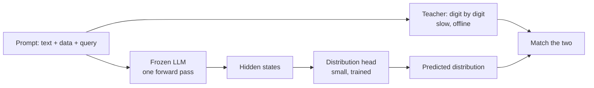

# The idea: a distribution head

LLM Processes \[1\] and amortized inference models \[3\].



```latex
\mathcal{L}(\phi) = -\sum_{b} p_{\text{teacher}}(b \mid \text{prompt}) \, \log q_{\phi}(b \mid h(\text{prompt}))
```
